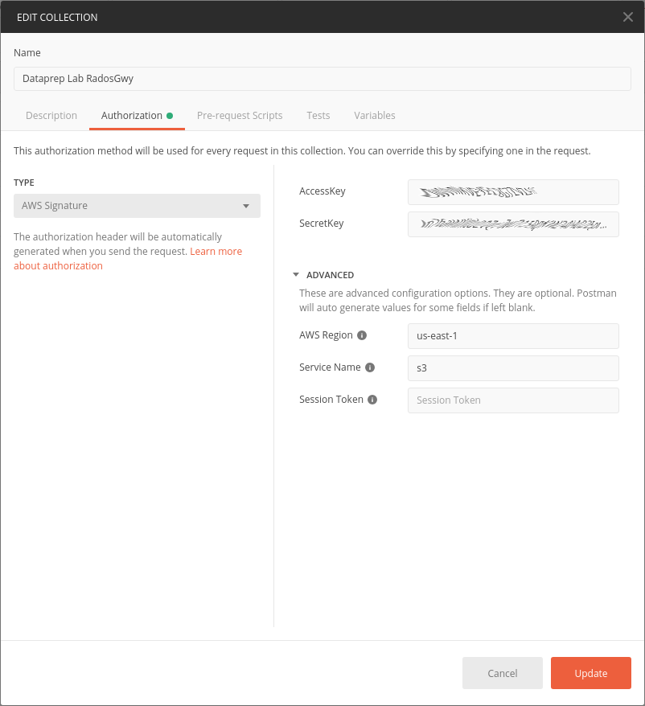
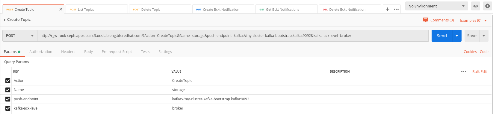
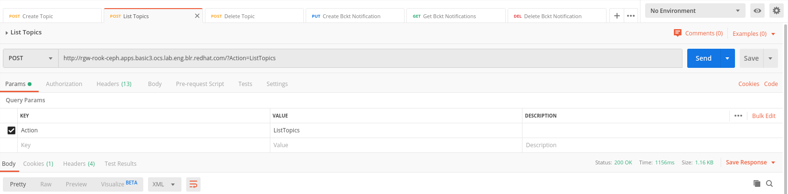
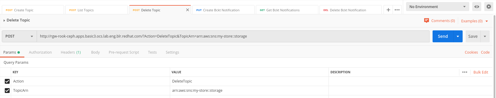
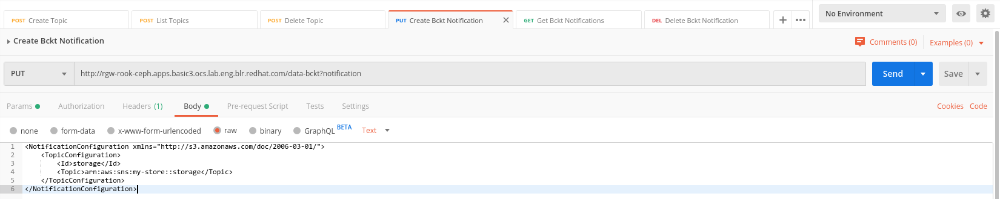
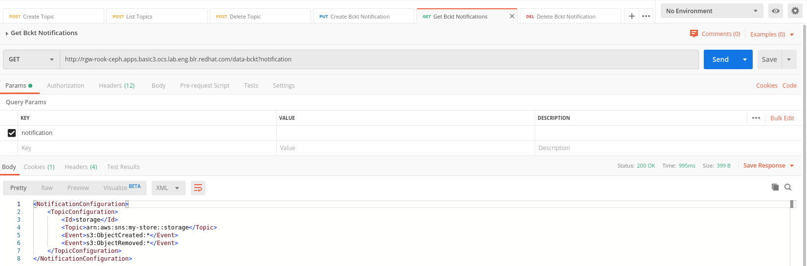
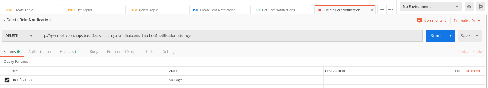

# Working with bucket notifications to Kafka

Two steps are required, that are done on the Ceph Rados Gateway (https://docs.ceph.com/docs/master/radosgw/notifications/[Ref]):

- Create a topic that will be configured to send event notifications to Kafka.
- Create a notification configuration on a bucket, bound to a previously created topic.


## Requirements
- A Ceph version with Kafka notifications enabled (currently master branch.)
- A Kafka installation with a topic created (in this example "storage") and the bootstrap server address.
- A bucket on which you want to enable notifications (in this example "data-bckt").

## Tooling
In this example, all the configurations are made using https://www.getpostman.com/[Postman] as it's easier to handle requests authorization.

- In Postman, create a Collection to store all your scripts (here Dataprep Lab RadosGwy), and configure authorization by entering the AccessKey and the SecretKey of the user who has access to the bucket for which you want to enable notifications. This will then be used for all scripts stored in this collection.



## Working with topics
You can create and save the following scripts in your collection for easy creation/deletion of topics.

- *Create a topic*: it's a post request to the gateway, with different parameters:
  * Action=CreateTopic
  * Name=name_of_your_topic
  * push-endpoint=kafka_address
  * kafka_ack_level=broker (default)


- *List topics*: it's a post request to the gateway, with parameter Action=ListTopics


- *Delete topic*: it's a post request to the gateway, with different parameters:
  * Action=DeleteTopic
  * TopicArn=unique id for your Topic (obtained at creation or with ListTopics)


## Working with Bucket Notifications

To enable/disable notifications for a bucket, you can create and save the following scripts.

- *Create bucket notification*: it's a PUT request to the bucket with a "notification" parameter and an XML body of this form:
```
<NotificationConfiguration xmlns="http://s3.amazonaws.com/doc/2006-03-01/">
    <TopicConfiguration>
        <Id>storage</Id>
        <Topic>arn:aws:sns:my-store::storage</Topic>
    </TopicConfiguration>
</NotificationConfiguration>
```


- *Get bucket notifications*: it's a GET request to the bucket with a "notification" parameter.


- *Delete bucket notification*: it's a DELETE request to the bucket with a "notification=id_of_notification" parameter.
